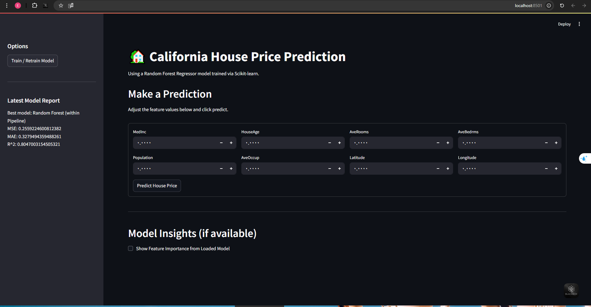

# 🏡 California House Price Prediction with Streamlit

This project demonstrates how to predict median house values in California census districts using a Random Forest Regressor model. The model is built using Scikit-learn, incorporating preprocessing steps within a pipeline. The user interface is created with Streamlit, allowing for interactive predictions and in-app model training.

## 🚀 Features

*   **Interactive Prediction:** Input values for house features (Median Income, House Age, etc.) and get a predicted median house value.
*   **In-App Model Training:** Train or retrain the Random Forest model directly from the Streamlit interface using a button in the sidebar.
*   **Evaluation Metrics:** View key performance metrics (R², MAE, MSE) after model training.
*   **Feature Importance:** Visualize the importance of different features as determined by the trained Random Forest model.
*   **Data Exploration (Optional):** View basic statistics and distributions of the dataset during the training process.

## 🛠️ Setup and Installation

Follow these steps to set up the project locally:

1.  **Prerequisites:**
    *   Python (version 3.8 or higher recommended)
    *   Git

2.  **Clone the Repository:**
    ```bash
    git clone <your-github-repository-url>
    cd <your-repository-name>
    ```
    <!-- Replace <your-github-repository-url> and <your-repository-name> with your actual repo details -->

3.  **Create and Activate a Virtual Environment:**
    *   It's highly recommended to use a virtual environment to manage dependencies.
    ```bash
    # Create the virtual environment
    python -m venv .venv

    # Activate the virtual environment:
    # Windows (Command Prompt):
    .venv\Scripts\activate
    # Windows (PowerShell):
    .venv\Scripts\Activate.ps1
    # macOS / Linux (Bash/Zsh):
    source .venv/bin/activate
    ```
    *   You should see `(.venv)` at the beginning of your terminal prompt.

4.  **Install Dependencies:**
    *   Install all the required Python libraries listed in `requirements.txt`.
    ```bash
    pip install -r requirements.txt
    ```

## ▶️ Running the Application

1.  **Make sure your virtual environment is activated.**
2.  **Run the Streamlit app from your terminal:**
    ```bash
    streamlit run streamlit_app.py
    ```
3.  Streamlit will start a local web server, and the application should automatically open in your default web browser (usually at `http://localhost:8501`).

## 📝 Usage Instructions

**Important First Step:**

*   The trained model file (`.pkl`) is **not included** in this repository (as specified in `.gitignore`).
*   When you run the application for the first time, it will likely show a message like "Model not found".
*   You **must** train the model first! Go to the **sidebar** on the left and click the **"Train / Retrain Model"** button.
*   The training process (especially `GridSearchCV`) might take **several minutes** depending on your computer's speed. You will see progress updates within the Streamlit app.

**Making Predictions:**

1.  Once the model is trained (or if it was loaded from a previous session), the main area will show the "Make a Prediction" section.
2.  Enter numerical values for each house feature in the input boxes provided.
3.  Click the **"Predict House Price"** button located within the form.
4.  The predicted median house value (typically in units of $100,000s) will be displayed below the button.

**Other Features:**

*   Use the checkboxes during or after training to view optional plots (Data Exploration, Feature Importance, Predicted vs Actual).
*   View the evaluation metrics (R², MAE, MSE) saved in the `model_report.txt` file via the sidebar after training.

## 📊 Dataset

This project uses the **California Housing dataset** available through Scikit-learn (`sklearn.datasets.fetch_california_housing`). The dataset is downloaded automatically when the training process runs. The target variable, `MedHouseVal`, represents the median house value in units of $100,000.

---


